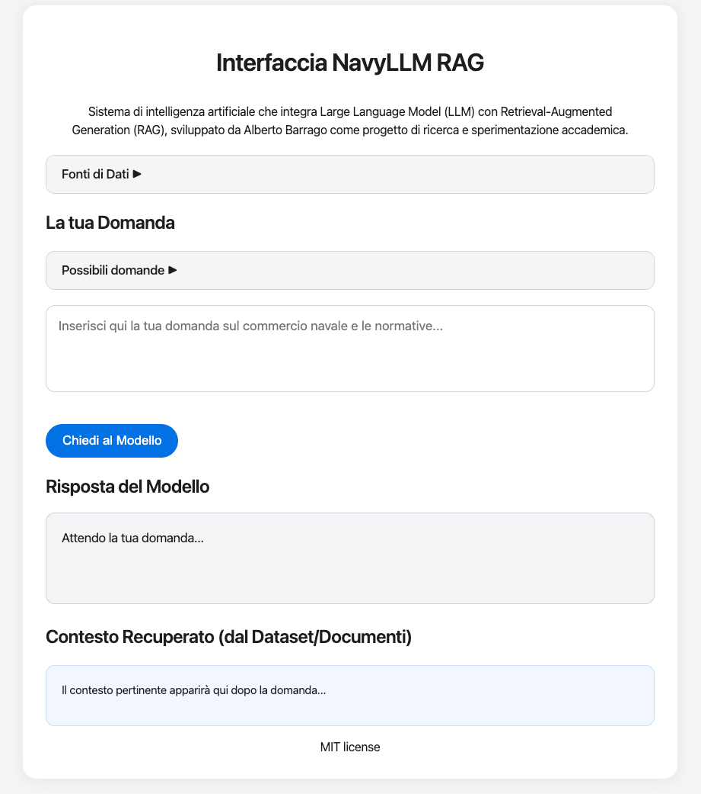

# Italian Customs & Maritime Trade API

A simple FastAPI application that provides answers to questions about Italian customs procedures, maritime shipping, and international trade regulations.

## Overview

This API provides expert responses on topics including:
- Italian customs regulations and procedures
- Maritime shipping documentation
- Port operations and authorities
- Import/export requirements
- Customs duties and taxes

## screenshot (ui) 


## Project Structure

- `api.py` - Backend for running uvicorn
- `main.py` - Execute LLM-RAG on terminal `python main.py`
- `ui`
  - `index.html` - Simple interface for a testing model
  - `main.js` - Main logic for static ui
  - `style.css` - Main style for static view
- `services`
  - `rag_engine.py` - Rag engine for contextualize data
  - `train.py` - LLM training core 
- `data`
  - `navi_trade_data.jsonl`

## Getting Started

> Before start, it's necessary to prepare from `navy_trade_data.jsonl` the LLM and the RAG engine
> execute this command:
> 
>
> `python services/train.py`
> 
> `python services/rag_engine.py`
## Prerequisites

- Python 3.12+
- Node.js (for frontend development)
- Modern web browser
- Required Python packages (see requirements.txt)

## Installation

1. Clone this repository:
   ```bash
   git clone [repository-url]
   cd NavyLLM
   ```

2. Create and activate a virtual environment:
   ```bash
   python -m venv venv
   source venv/bin/activate  # On Windows use: venv\Scripts\activate
   ```

3. Install the required Python packages:
   ```bash
   pip install -r requirements.txt
   ```

## Running the Application

1. Start the backend API server:
   ```bash
   uvicorn api:app --reload --port 8000
   ```
   The API will be available at http://127.0.0.1:8000

2. Open the frontend interface:
   - Simply open `index.html` in your web browser
   - Or serve it using a local HTTP server:
     ```bash
     python -m http.server 3000
     ```
     Then visit http://localhost:3000

## Usage

1. Open the web interface in your browser
2. Type your question about maritime trade, customs, or related regulations
3. Click "Chiedi al Modello" (Ask the Model)
4. The system will provide:
   - A detailed answer based on the LLM
   - Relevant context from the source documents

## Development

### Frontend
- HTML5 with modern CSS
- Vanilla JavaScript
- Apple-style UI design

### Backend
- FastAPI for the API server
- RAG implementation for context-aware responses
- JSON-based data storage

## Contributing

1. Fork the repository
2. Create your feature branch (`git checkout -b feature/AmazingFeature`)
3. Commit your changes (`git commit -m 'Add some AmazingFeature'`)
4. Push to the branch (`git push origin feature/AmazingFeature`)
5. Open a Pull Request

## License

This project is intended for research and experimentation purposes.

## Author

Alberto Barrago
